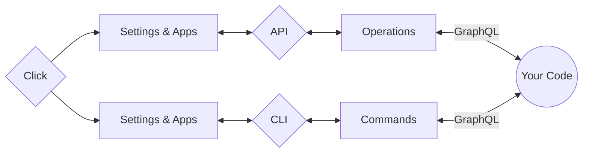

#

<div style="text-align:center; margin-top: -60px">
 
</div>

---

<p align="center" class="name-acronym" >
    (<strong>Z</strong>)eroMQ (<strong>M</strong>)anages — (<strong>A</strong>) — (<strong>G</strong>)raphQL
</p>

---

<!-- termynal -->

```
$ python -m pip install "zmag[server]"
---> 100%
Successfully installed zmag!
```

---

**{{ config.site_name }}** is a tool designed for building **network APIs** rather than traditional web applications, leveraging the unique combination of **GraphQL** and **ZeroMQ**. By integrating **GraphQL's** flexible and efficient querying capabilities with **ZeroMQ's** high-performance messaging patterns, **{{ config.site_name }}** enables developers to create robust and scalable network APIs. This approach allows for real-time communication, seamless data transfer, and efficient management of complex, distributed systems, making **{{ config.site_name }}** an ideal choice for developers looking to build sophisticated network services that go beyond the capabilities of standard web applications.

**{{ config.site_name }}** is designed to provide a more Pythonic syntax, moving away from the typical GraphQL and ZeroMQ styles and focusing instead on native Python conventions for greater readability and intuitiveness.

!!! info "Capabilities of {{ config.site_name }}"

    1. Build **GraphQL** **Queries** and **Mutations** for flexible data interactions.
    2. Develop **Request** and **Response** APIs for efficient communication.
    3. Implement **Pub/Sub** and **Push/Pull** patterns for robust messaging and data distribution.
    4. Leverage **Commands** to automate processes and streamline operations.

---

## Built With

| Module                                         | Purpose                                                            |
| ---------------------------------------------- | ------------------------------------------------------------------ |
| [**Pyzmq**](https://pyzmq.readthedocs.io)      | Core **Universal Messaging Library** for the API.                  |
| [**Strawberry**](https://strawberry.rocks/)    | **GraphQL Library**                                                |
| [**Click**](https://github.com/pallets/click/) | Manage the server, development processes, and custom **Commands**. |
| [**SPOC**](https://pypi.org/project/spoc/)     | **Framework tool** for building this framework.                    |

## Debug Server Built With

| Module                                                   | Purpose                               |
| -------------------------------------------------------- | ------------------------------------- |
| [**Starlette**](https://www.starlette.io/)               | Runs the server in **Debug** mode.    |
| [**Uvicorn**](https://www.uvicorn.org/)                  | ASGI web server.                      |
| [**Watchdog**](https://github.com/gorakhargosh/watchdog) | Restarts the debug server on changes. |

---

## Installation

To install **{{ config.site_name }}** in different environments, use the following commands:

### **Development** Environment

```sh
python -m pip install "zmag[debug,server]"
```

### **Server** Environment

```sh
python -m pip install "zmag[server]"
```

### **Client** Environment

```sh
python -m pip install "zmag"
```

!!! warning

    ZMAG is currently in its early stages of development, so there may be some changes in the future. However, we aim to keep the public API stable.

---

## Project **Flowchart**

| **(API)** Application Programming Interface | **(CLI)** Command-Line Interface     |
| ------------------------------------------- | ------------------------------------ |
| 1. Load all **`Settings`**.                 | 1. Load all **`Settings`**.          |
| 2. Load **`Environment Variables`**.        | 2. Load **`Environment Variables`**. |
| 3. Load all **`Apps` (Packages)**.          | 3. Load all **`Apps` (Packages)**.   |
| 4. Start the **`ZMQ`** **Backend**          | 4. Start the **`CLI`** **Manager**.  |



### Explanation

The flowchart illustrates how the project initializes and operates both the **API** and **CLI** interfaces:

1.  **Initialization**: The process begins with **Click**, which is used to launch both the API (services) and CLI (commands).
2.  **Configuration Loading**: For both the API and CLI interfaces, all **`Settings`**, **`Environment Variables`**, and **`Apps (Modules)`** are loaded. This ensures the environment is properly configured and all necessary modules are available.

3.  **Starting Interfaces**:

    !!! Note "Interfaces"

         - **API** — the **ZeroMQ Backend** is started to manage backend processes and facilitate operations.
         - **CLI** — the **CLI Manager** is initiated using Click, which handles command-line inputs and operations.

4.  **Integration with GraphQL**: Both the **API** and **CLI** interfaces can connect to the **GraphQL**, allowing you to perform GraphQL operations through either the **API Backend** or the **CLI Commands**.

5.  **Custom Extensions**: You have the flexibility to create custom **CLI** commands or **API** methods, which can leverage the underlying **GraphQL** capabilities integrated with both **`ZeroMQ`** and **`Click`**.

!!! tip

    The setup provides a versatile and unified framework, enabling you to manage backend processes and handle command-line operations effectively, with seamless integration of GraphQL functionalities across both interfaces.

---

## Core **Layout**

```text
root/                           --> <Directory> - Project's Root
|
|-- apps/                       --> <Directory> - Project's Apps
|
|-- config/                     --> <Directory> - Configurations
|    |-- .env                   --> <Directory> - Environment Settings
|    |-- ...
|    |-- settings.py            --> <File> - Pythonic API Settings
|    `-- spoc.toml              --> <File> - TOML API Settings
|
`-- etc...
```

---

## Key Commands

**{{ config.site_name }}** comes with several key commands:

| Command                               | Purpose                                                                   |
| ------------------------------------- | ------------------------------------------------------------------------- |
| `{{ config.site_name.lower() }}-init` | Create a new **{{ config.site_name }}** project.                          |
| `./main.py run`                       | Run the **Server**.                                                       |
| `./main.py start-app`                 | Create a **{{ config.site_name }} App** inside your **`apps`** directory. |
| `./main.py --help`                    | Display more information about available commands.                        |

!!! warning "Important: `zmag-init` Command"

    Use the `zmag-init` command **only once** and make sure you are in a **new folder**. This command will write files and folders to the current directory.
