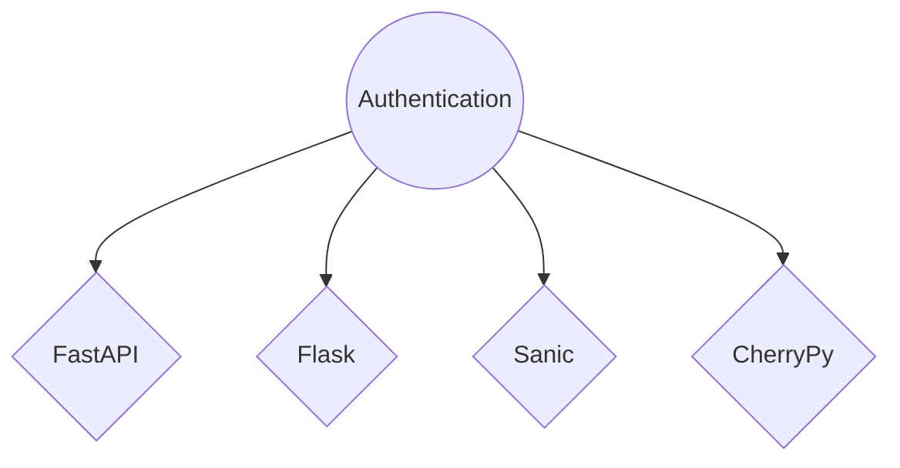

# Motivation — **The Reason Behind**

The motivation behind creating this project stems from a gap I noticed in existing solutions: I could not find any projects that combine ZeroMQ and GraphQL. I believe this combination offers a unique and powerful approach to building network applications, particularly for internal use within larger systems.

Unlike frameworks like Django, Flask, FastAPI, and others, which are typically designed for building APIs for end-users, ZMAG is tailored for internal projects and microservices. The idea is to create reusable components — such as an authentication system — that multiple projects can leverage. For example, you could develop a centralized authentication system with ZMAG and then integrate it with multiple FastAPI or Flask applications. This modular approach allows these components to communicate efficiently, whether they are on the same server, within a local network, or even across the internet.

By leveraging ZeroMQ for efficient, low-latency messaging and GraphQL for flexible, self-documenting APIs, ZMAG enables developers to build sophisticated network applications that are both performant and maintainable. The goal is to provide a framework that simplifies the creation of internal services and allows seamless integration across various parts of a project or multiple projects.

Additionally, I aimed to make the codebase as Pythonic as possible, minimizing the need to use GraphQL specific syntax. The intent is to create a natural development experience that feels like writing regular Python classes and functions while still benefiting from GraphQL’s automatic documentation and powerful querying capabilities. This approach ensures that developers can focus on building Python applications without needing to extensively learn the intricacies of GraphQL syntax.
