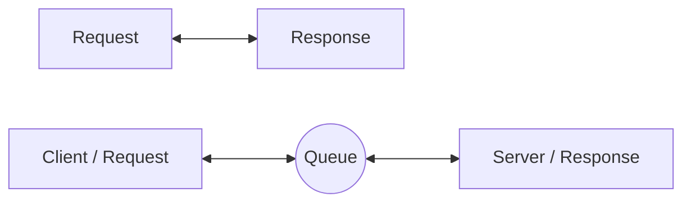
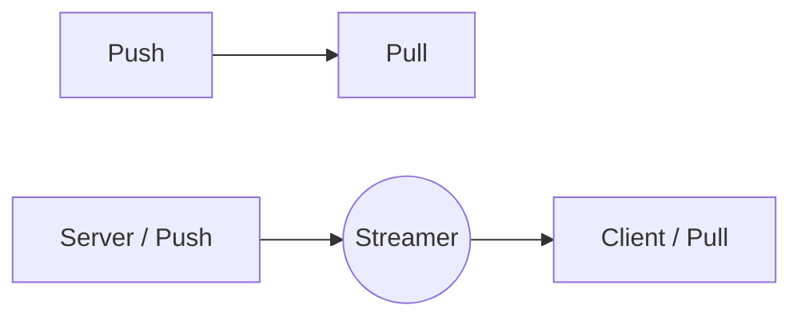
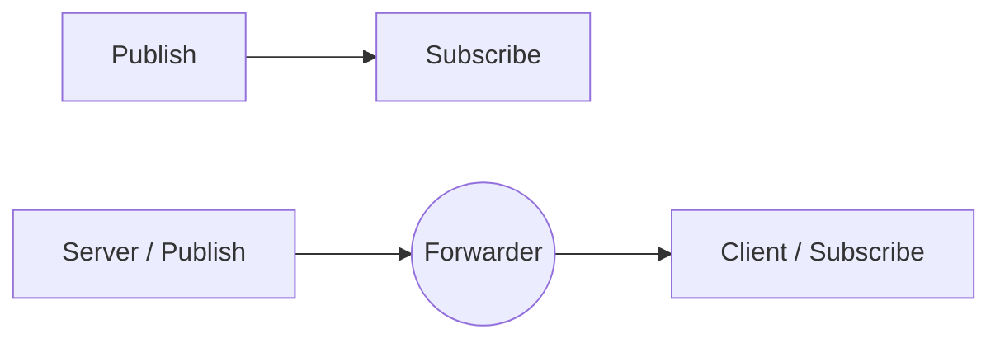

# **Server** Introduction

To get started with the ZMAG server, first install the package:

```sh
python -m pip install "zmag[server]"
```

In **ZMAG**, the **server** represents the **backend**. Some ZeroMQ tutorials use the terms "backend" and "frontend" instead of "server" and "client" because not everything is always a straightforward server/client model. However, to maintain a beginner-friendly and consistent naming convention, we'll stick with "server" and "client."

This naming convention is also chosen because the server and client are symmetrically structured.

| For example... | As compared to... |
| -------------- | ----------------- |
| `client`       | `frontend`        |
| `server`       | `backend`         |

## Devices (Types)

- **`Queue`**
- **`Streamer`**
- **`Forwarder`**

---

### Bidirectional Information Flow (Request/Response)



---

### Unidirectional Information Flow (Push/Pull)



---

### Unidirectional Information Flow (Publish/Subscribe)



<style>

/* Mermaid */
.mermaid {
  text-align: left;
  zoom: 80%;
}
</style>
